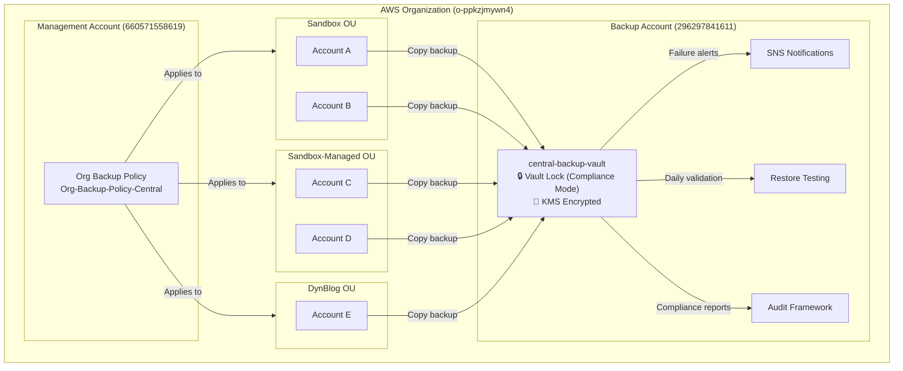
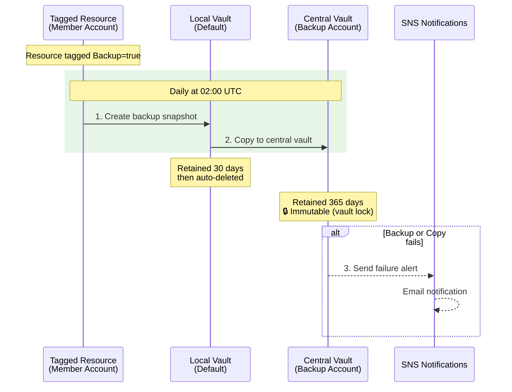
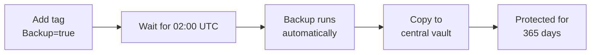
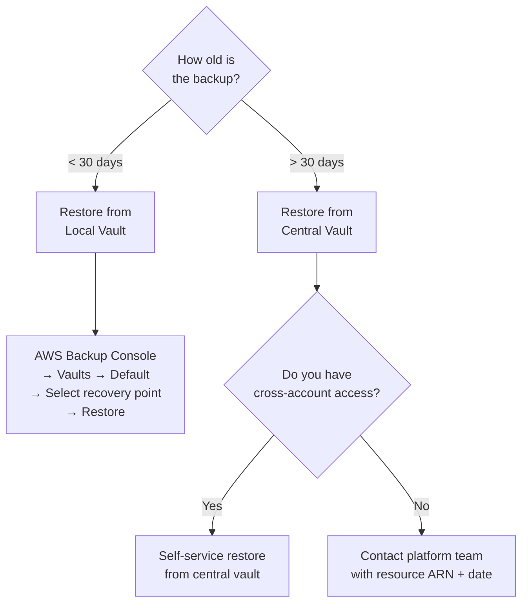
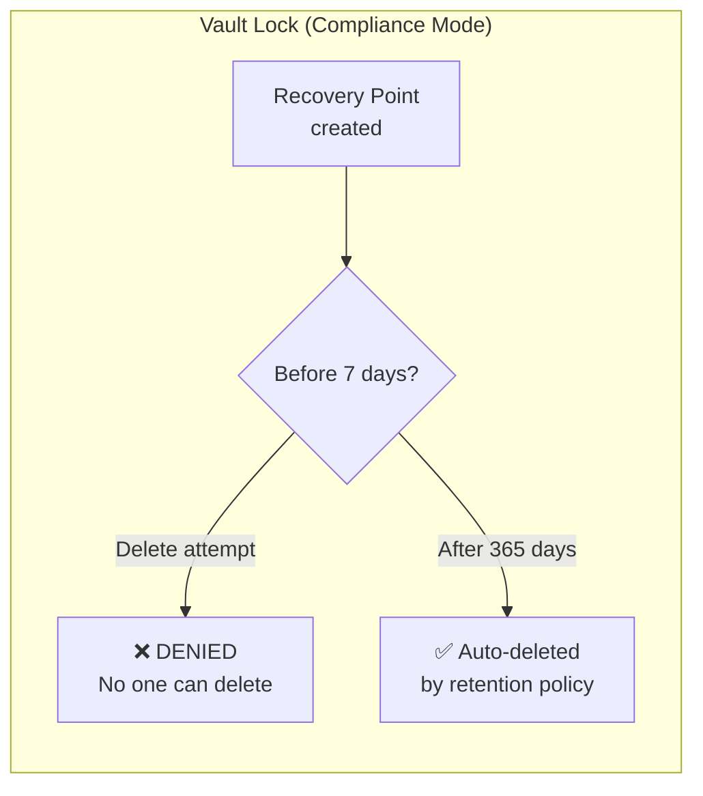
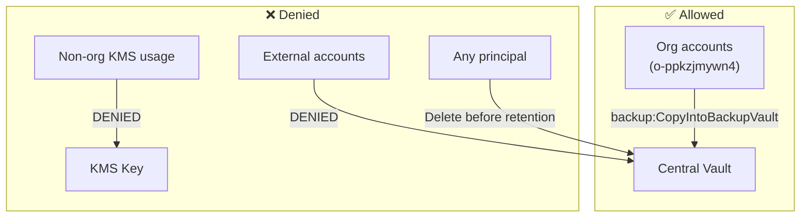
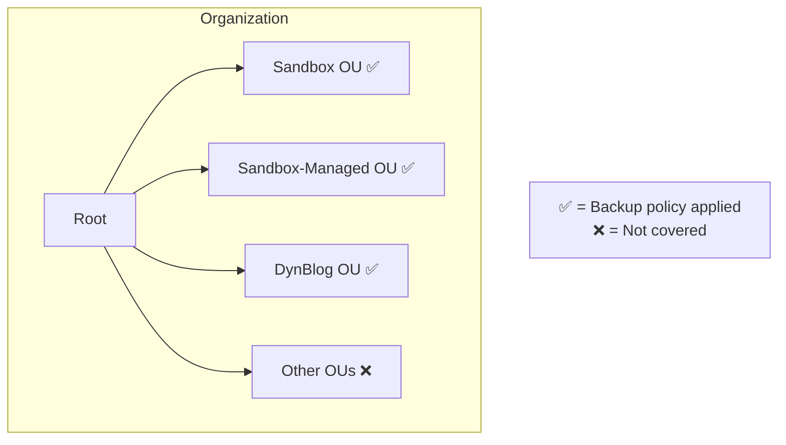

# Centralized Backup — Developer Guide

## Overview

Our organization uses a centralized AWS Backup solution that automatically protects tagged resources across all member accounts. Backups are copied daily to an isolated, immutable vault in a dedicated backup account.

**Key facts:**
- Backup account: `dyn-backup-account` (296297841611)
- Region: eu-central-1
- Schedule: Daily at 02:00 UTC
- Vault lock: Compliance mode (backups cannot be manually deleted)
- Covered OUs: Sandbox, Sandbox-Managed, DynBlog

---

## Architecture



---

## Backup Flow



---

## How It Works

```
┌─────────────────────────┐              ┌──────────────────────────────────┐
│   Member Account        │              │   Backup Account (296297841611)  │
│                         │    copy      │                                  │
│  Tagged Resource        │─────────────▶│  central-backup-vault            │
│  (Backup=true)          │              │  ├─ KMS encrypted                │
│                         │              │  ├─ Vault lock (compliance)      │
│  Local vault (Default)  │              │  ├─ Min retention: 7 days        │
│  └─ 30-day retention    │              │  └─ Max retention: 365 days      │
└─────────────────────────┘              └──────────────────────────────────┘
```

1. You tag your resource with `Backup=true`
2. The organization backup policy picks it up automatically
3. A local backup runs daily at 02:00 UTC
4. On success, the recovery point is copied to the central vault
5. Local copy is retained for 30 days, central copy for up to 365 days

---

## Supported Services

| Service | Resource Type | Tag Required |
|---------|--------------|--------------|
| S3 | Buckets | `Backup=true` |
| DynamoDB | Tables | `Backup=true` |
| RDS | DB instances | `Backup=true` |
| OpenSearch | Domains | `Backup=true` |
| EFS | File systems | `Backup=true` |
| EBS | Volumes | `Backup=true` |
| EC2 | Instances | `Backup=true` |

> Any AWS Backup-supported resource tagged `Backup=true` will be backed up.

---

## How to Enable Backups for Your Resources



Add the tag `Backup` with value `true` (case-sensitive) to any supported resource. That's it — the organization policy handles the rest automatically.

### Examples

**AWS CLI — Tag an S3 bucket:**
```bash
aws s3api put-bucket-tagging --bucket my-bucket --tagging 'TagSet=[{Key=Backup,Value=true}]'
```

**AWS CLI — Tag an RDS instance:**
```bash
aws rds add-tags-to-resource \
  --resource-name arn:aws:rds:eu-central-1:123456789012:db:my-database \
  --tags Key=Backup,Value=true
```

**AWS CLI — Tag a DynamoDB table:**
```bash
aws dynamodb tag-resource \
  --resource-arn arn:aws:dynamodb:eu-central-1:123456789012:table/my-table \
  --tags Key=Backup,Value=true
```

**AWS CLI — Tag an EFS file system:**
```bash
aws efs tag-resource \
  --resource-id fs-12345678 \
  --tags Key=Backup,Value=true
```

**Terraform:**
```hcl
resource "aws_s3_bucket" "example" {
  bucket = "my-bucket"

  tags = {
    Backup = "true"
  }
}
```

### Prerequisites

Your account must have the `AWSBackupDefaultServiceRole` IAM role. This role is deployed automatically via AFT global customizations. If backups are failing, verify the role exists:

```bash
aws iam get-role --role-name AWSBackupDefaultServiceRole
```

If it doesn't exist, contact the platform team.

---

## How to Initiate a Data Restore



### Restore from Your Local Vault (< 30 days old)

1. Open the AWS Backup console in your account
2. Navigate to **Backup vaults** → **Default**
3. Find the recovery point for your resource
4. Select the recovery point and choose **Restore**
5. Configure restore parameters (varies by service) and submit

**AWS CLI example — Restore an RDS instance:**
```bash
# List recovery points for your resource
aws backup list-recovery-points-by-resource \
  --resource-arn arn:aws:rds:eu-central-1:123456789012:db:my-database \
  --region eu-central-1

# Start restore job
aws backup start-restore-job \
  --recovery-point-arn <recovery-point-arn> \
  --iam-role-arn arn:aws:iam::123456789012:role/service-role/AWSBackupDefaultServiceRole \
  --metadata '{"DBInstanceIdentifier":"my-database-restored"}' \
  --region eu-central-1
```

### Restore from the Central Vault (> 30 days old)

For recovery points older than 30 days, the local copy has been deleted and you need to restore from the central vault. This requires cross-account access.

**Process:**

1. Contact the platform team with:
   - The resource ARN you need to restore
   - The approximate date of the backup you need
   - The target account where you want the restore

2. The platform team will:
   - Locate the recovery point in the central vault
   - Initiate a cross-account restore or copy the recovery point back to your account
   - Confirm when the restore is available

**Self-service (if you have cross-account access):**
```bash
# List recovery points in the central vault
aws backup list-recovery-points-by-backup-vault \
  --backup-vault-name central-backup-vault \
  --region eu-central-1 \
  --profile backup

# Copy recovery point back to your account's vault
aws backup start-copy-job \
  --recovery-point-arn <recovery-point-arn> \
  --source-backup-vault-name central-backup-vault \
  --destination-backup-vault-arn arn:aws:backup:eu-central-1:<your-account-id>:backup-vault:Default \
  --iam-role-arn arn:aws:iam::<backup-account-id>:role/service-role/AWSBackupDefaultServiceRole \
  --region eu-central-1 \
  --profile backup
```

---

## Retention Policies

```mermaid
gantt
    title Backup Retention Timeline
    dateFormat  X
    axisFormat %d days

    section Local Vault
    Local backup retained    :active, 0, 30

    section Central Vault
    Min retention (locked)   :crit, 0, 7
    Central backup retained  :active, 0, 365
```



| Location | Retention | Deletable? |
|----------|-----------|------------|
| Local vault (your account) | 30 days | Auto-deleted after 30 days |
| Central vault (backup account) | 7–365 days | **No** — only expires via retention policy |

### Immutability Rules



- **No manual deletion**: Recovery points in the central vault cannot be deleted by anyone — not even administrators or root users
- **Vault lock (compliance mode)**: Once the 3-day cooling-off period passes, the lock is permanent and irreversible
- **Minimum retention**: 7 days — no recovery point can be removed before this
- **Maximum retention**: 365 days — recovery points are automatically cleaned up after this period
- **Encryption**: All backups are encrypted with a customer-managed KMS key (automatic rotation every 365 days)

---

## Security Model



| Action | Who can do it? |
|--------|---------------|
| Copy backup into central vault | Only org accounts |
| Delete recovery points | No one (vault lock) |
| Restore from central vault | Backup account admins only |
| Use KMS key | Only org accounts via backup service |
| Modify vault lock | No one (after cooling-off period) |

---

## Monitoring and Troubleshooting

### Where to check

| What to check | Where | Profile |
|---------------|-------|---------|
| Backup jobs ran | Member account → AWS Backup → Jobs | Your account |
| Copy jobs succeeded | Member account → AWS Backup → Jobs → Copy jobs | Your account |
| Recovery points in central vault | Backup account → AWS Backup → Vaults | `backup` |
| Compliance reports | Backup account → AWS Backup → Audit Manager | `backup` |

### CLI commands

```bash
# Check if your resource is being backed up
aws backup list-backup-jobs \
  --by-resource-arn arn:aws:rds:eu-central-1:123456789012:db:my-database \
  --by-state COMPLETED \
  --region eu-central-1

# Check for failed backup jobs
aws backup list-backup-jobs \
  --by-state FAILED \
  --region eu-central-1

# Check recovery points in central vault
aws backup list-recovery-points-by-backup-vault \
  --backup-vault-name central-backup-vault \
  --region eu-central-1 \
  --profile backup
```

### Common issues

| Problem | Cause | Fix |
|---------|-------|-----|
| No backups running | Missing `Backup=true` tag | Add the tag (case-sensitive) |
| Backup job fails | Missing IAM role | Ensure `AWSBackupDefaultServiceRole` exists |
| Copy to central vault fails | KMS key permissions | Contact platform team |
| Resource not supported | Unsupported resource type | Check supported services list above |

---

## Covered Accounts



The backup policy applies to all accounts in these organizational units:
- **Sandbox** OU
- **Sandbox-Managed** OU
- **DynBlog** OU

New accounts added to these OUs are automatically covered. If your account is in a different OU and you need backup coverage, contact the platform team.

---

## Cost Awareness

Backup costs are charged to the **backup account**, not your workload account. Approximate storage costs (eu-central-1):

| Service | Cost per GB/month |
|---------|-------------------|
| S3 | $0.05 |
| DynamoDB | $0.10 |
| RDS | $0.095 |
| OpenSearch | $0.05 |
| EFS | $0.05 |
| Cross-account copy | $0.02/GB (one-time) |

**Example**: A 100 GB RDS database backed up daily with 365-day central retention ≈ $9.50/month in central vault storage.

---

## Adding New OUs

To extend backup coverage to additional OUs, update the `ou_ids` variable in `terraform.tfvars`:

```hcl
ou_ids = [
  "ou-rzmo-qfmzlwhq", # Sandbox
  "ou-rzmo-bjyh9b48", # Sandbox-Managed
  "ou-rzmo-b9fl9bvd", # DynBlog
  "ou-xxxx-xxxxxxxx"  # New OU
]
```

Then run `terraform apply`. All accounts in the new OU are immediately covered.

---

## Contact

For questions, restore requests, or issues:
- Platform team (backup operations)
- Slack: #platform-engineering
