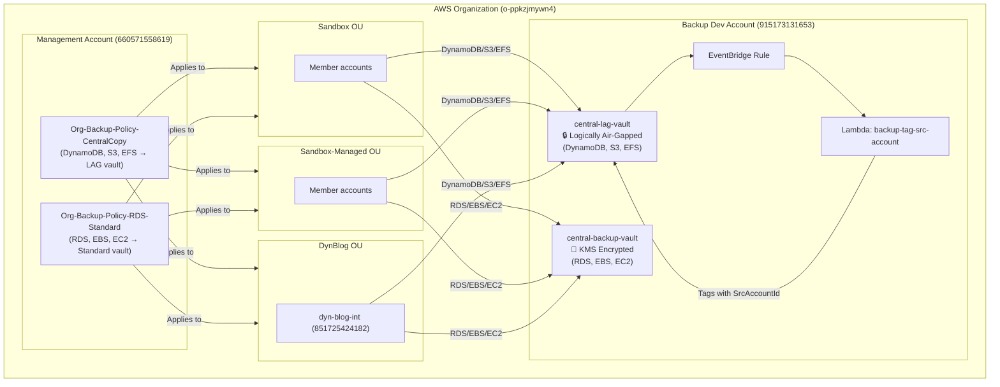
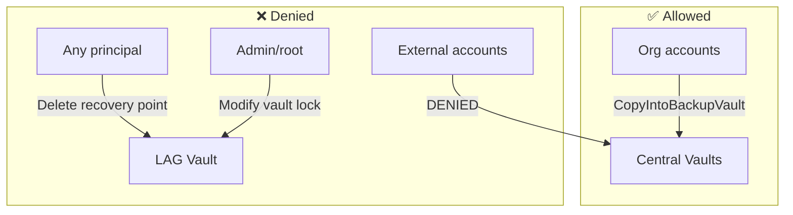
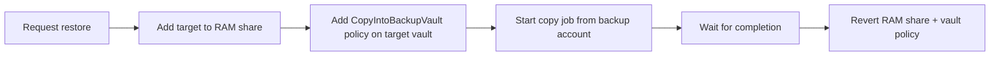

# Centralized Backup Solution — Project Documentation

## Executive Summary

A centralized AWS Backup solution deployed across the Dynmedia AWS Organization that automatically protects tagged resources in member accounts. Backups are stored immutably in a dedicated backup account, ensuring no actor (including administrators) can delete backup data. The solution eliminates the need for third-party backup tools and provides ransomware resilience through account isolation and vault lock compliance mode.

---

## Architecture



---

## Accounts & Roles

| Account | ID | Purpose |
|---------|-----|---------|
| Management | 660571558619 | Manages org backup policies |
| Backup Dev | 915173131653 | Hosts central vaults (LAG + standard) |
| Backup Prod | 296297841611 | Future production target |
| AFT | 035531823980 | Pipeline orchestration |
| dyn-blog-int | 851725424182 | Primary test account |

| Role | Where | Purpose |
|------|-------|---------|
| DynCentralizedBackupRole | Member accounts | Backup and copy operations |
| AWSBackupDefaultServiceRole | All accounts (via AFT) | Fallback backup role + cross-account operations |
| AWSAFTExecution | All accounts | AFT pipeline execution |

---

## Vaults

### central-lag-vault (Logically Air-Gapped)

| Property | Value |
|----------|-------|
| Account | 915173131653 |
| Type | Logically Air-Gapped |
| Min retention | 7 days |
| Max retention | 365 days |
| Vault lock | Built-in compliance mode (immutable) |
| Encryption | AWS-owned key |
| Supported resources | DynamoDB, S3, EFS |
| Access | RAM shared to org accounts |

### central-backup-vault (Standard)

| Property | Value |
|----------|-------|
| Account | 915173131653 |
| Type | Standard |
| Encryption | Customer-managed KMS key |
| Vault lock | Not enabled (count = 0) |
| Supported resources | RDS, EBS, EC2 |
| Access | Vault policy (org-only CopyIntoBackupVault) |

---

## Backup Policies

### Policy 1: Org-Backup-Policy-CentralCopy

**Target:** DynamoDB, S3, EFS → `central-lag-vault`

| Plan | Schedule | Tag Value | Central Retention |
|------|----------|-----------|-------------------|
| Hourly | Every hour | `Backup=hourly` | 7 days |
| Two-times-per-day | 10:00 & 22:00 UTC | `Backup=two-times-per-day` | 14 days |
| Daily | 02:00 UTC | `Backup=daily` | 365 days |
| Weekly | Sunday 04:00 UTC | `Backup=weekly` | 365 days |
| Monthly | 1st of month 05:00 UTC | `Backup=monthly` | 365 days |

### Policy 2: Org-Backup-Policy-RDS-Standard

**Target:** RDS, EBS, EC2 → `central-backup-vault`

| Plan | Schedule | Tag Value | Local Retention | Central Retention |
|------|----------|-----------|-----------------|-------------------|
| Daily | 02:00 UTC | `Backup=daily` | 30 days | 365 days |

---

## Covered OUs

| OU | ID | Status |
|----|----|--------|
| Sandbox | ou-rzmo-qfmzlwhq | ✅ Covered |
| Sandbox-Managed | ou-rzmo-bjyh9b48 | ✅ Covered |
| DynBlog | ou-rzmo-b9fl9bvd | ✅ Covered |

New accounts added to these OUs are automatically covered.

---

## How to Enable Backups

Tag any supported resource with the appropriate `Backup` tag:

```bash
# Daily backup
aws rds add-tags-to-resource --resource-name <arn> --tags Key=Backup,Value=daily

# Hourly backup
aws dynamodb tag-resource --resource-arn <arn> --tags Key=Backup,Value=hourly
```

Valid tag values: `hourly`, `two-times-per-day`, `daily`, `weekly`, `monthly`

### Prerequisites per member account

- `DynCentralizedBackupRole` IAM role (deployed via AFT account customizations)
- `AWSBackupDefaultServiceRole` (deployed via AFT global customizations)
- `Default` backup vault (deployed via AFT global customizations)

---

## Security Model



- **Immutability:** LAG vault has built-in compliance mode — no one can delete recovery points before retention expires
- **Isolation:** Backups stored in a separate dedicated account
- **Encryption:** Standard vault uses customer-managed KMS key; LAG vault uses AWS-owned key
- **Access control:** Vault policies restrict copy-in to org accounts only
- **Traceability:** Lambda tags every recovery point with `SrcAccountId`

---

## Cross-Account Restore (Exception Path)

By default, cross-account copies from the central vault are blocked. To perform an intentional restore:



### Step-by-step

1. **Add target account to RAM share** (backup dev account):
```bash
aws ram associate-resource-share \
  --resource-share-arn arn:aws:ram:eu-central-1:915173131653:resource-share/<share-id> \
  --principals <target-account-id> \
  --region eu-central-1 --profile backup-dev
```

2. **Add vault policy on target account's Default vault:**
```json
{
  "Version": "2012-10-17",
  "Statement": [{
    "Sid": "AllowCopyFromBackupAccount",
    "Effect": "Allow",
    "Principal": { "AWS": "arn:aws:iam::915173131653:root" },
    "Action": "backup:CopyIntoBackupVault",
    "Resource": "*"
  }]
}
```

3. **Start copy job** (from backup dev account):
```bash
aws backup start-copy-job \
  --recovery-point-arn <recovery-point-arn> \
  --source-backup-vault-name central-lag-vault \
  --destination-backup-vault-arn arn:aws:backup:eu-central-1:<target>:backup-vault:Default \
  --iam-role-arn arn:aws:iam::915173131653:role/service-role/AWSBackupDefaultServiceRole \
  --region eu-central-1 --profile backup-dev
```

4. **Revert access** after completion.

### Validated test

- Source: `central-lag-vault` (DynamoDB recovery point)
- Target: Sandbox account `199964506618`
- Result: ✅ COMPLETED

---

## RDS CMK Cross-Account Restore

For RDS instances encrypted with a Customer Managed Key (CMK), additional KMS key policy updates are required on the source key:

```json
{
  "Sid": "AllowCrossAccountDecrypt",
  "Effect": "Allow",
  "Principal": { "AWS": "arn:aws:iam::<target-account>:root" },
  "Action": ["kms:Decrypt", "kms:CreateGrant", "kms:DescribeKey"],
  "Resource": "*"
}
```

This grants the target account permission to decrypt the RDS snapshot during restore.

---

## Regional Limitation

**RDS/EBS/EC2 do not support cross-account copy to logically air-gapped vaults in eu-central-1.**

Error: `"Copy involving logically air-gapped vault for the provided resource type is not supported in the provided source or destination region."`

**Resolution:** Split into two org policies — LAG-supported resources go to the LAG vault, unsupported resources go to the standard vault.

---

## EventBridge + Lambda (Tagging)

When a copy job completes into the central vault:

1. EventBridge rule detects `Copy Job State Change` → `COMPLETED`
2. Triggers Lambda `backup-tag-src-account`
3. Lambda extracts `SrcAccountId` from the source resource ARN
4. Tags the recovery point with `SrcAccountId=<12-digit-account-id>`

This provides traceability — you can identify which account a backup originated from.

---

## Deployment via AFT

### Global Customizations (all accounts)
- Repo: `Dynmedia/aft-global-customizations`
- Deploys: `AWSBackupDefaultServiceRole` + `Default` vault
- Pipeline: `ct-aft-account-provisioning-customizations`

### Account Customizations (backup dev account)
- Repo: `Dynmedia/aft-account-customizations` (folder: `backup/`)
- Deploys: LAG vault, standard vault, org policies, Lambda, EventBridge, RAM share
- Pipeline: `915173131653-customizations-pipeline`

### Member Account Customizations
- The `centralized-backup` module in `aft-account-customizations` deploys `DynCentralizedBackupRole` and associates accounts with the RAM share

---

## Monitoring & Alerting

| Check | How |
|-------|-----|
| Backup jobs | AWS Backup Console → Jobs → Backup jobs |
| Copy jobs | AWS Backup Console → Jobs → Copy jobs |
| Recovery points | Backup account → Vaults → central-lag-vault / central-backup-vault |
| Failures | EventBridge → SNS email alerts (ahmed.sajib@dynmedia.com) |

### CLI commands

```bash
# Check backup jobs in a member account
aws backup list-backup-jobs --region eu-central-1 --profile <member-profile>

# Check copy jobs
aws backup list-copy-jobs --region eu-central-1 --profile <member-profile>

# Check recovery points in LAG vault
aws backup list-recovery-points-by-backup-vault \
  --backup-vault-name central-lag-vault \
  --region eu-central-1 --profile backup-dev

# Check recovery points in standard vault
aws backup list-recovery-points-by-backup-vault \
  --backup-vault-name central-backup-vault \
  --region eu-central-1 --profile backup-dev
```

---

## Cost

| Service | Cost per GB/month |
|---------|-------------------|
| S3 | $0.05 |
| DynamoDB | $0.10 |
| RDS | $0.095 |
| EFS | $0.05 |
| EBS | $0.05 |
| Cross-account copy | $0.02/GB (one-time) |

---

## Project Timeline & Key Decisions

| Date | Action |
|------|--------|
| Initial | Existing policy deployed to dev LAG vault (unknown who/when) |
| 2025-08-13 | central-backup-vault manually created in mgmt account |
| 2026-06-15 | PR #123 merged — backup infrastructure deployed via AFT |
| 2026-06-15 | Fixed: missing jinja templates, api_helpers |
| 2026-06-15 | Global customizations merged (role + Default vault) |
| 2026-06-17 | Tagging applied to dyn-blog-int (RDS + EFS) |
| 2026-06-17 | Cross-account restore tested (DynamoDB → Sandbox) ✅ |
| 2026-06-22 | RDS LAG vault copy failure identified (regional limitation) |
| 2026-06-29 | Policy split: LAG for DynamoDB/S3/EFS, Standard for RDS/EBS/EC2 |
| 2026-07-13 | RDS copies to standard vault confirmed working ✅ |

---

## Future Enhancements

1. **Production rollout** — deploy to backup prod account (296297841611)
2. **Multi-Party Approval (MPA)** — add approval teams for LAG vault access during incidents
3. **Restore testing** — automated daily validation that backups are restorable
4. **Audit Manager** — compliance framework for backup coverage reporting
5. **Expand OUs** — add Workloads, Infrastructure OUs when ready
6. **Vault lock on standard vault** — enable compliance mode for RDS backups

---

## Files & Repositories

| Repository | Purpose |
|-----------|---------|
| `Dynmedia/aft-account-customizations` (backup/) | Vault, policies, Lambda, EventBridge |
| `Dynmedia/aft-global-customizations` | IAM role + Default vault for all accounts |
| This repo (docs/) | Documentation |

---

## Contacts

- Platform team (backup operations)
- Primary engineer: Ahmed Sajib (ahmed.sajib@dynmedia.com)
